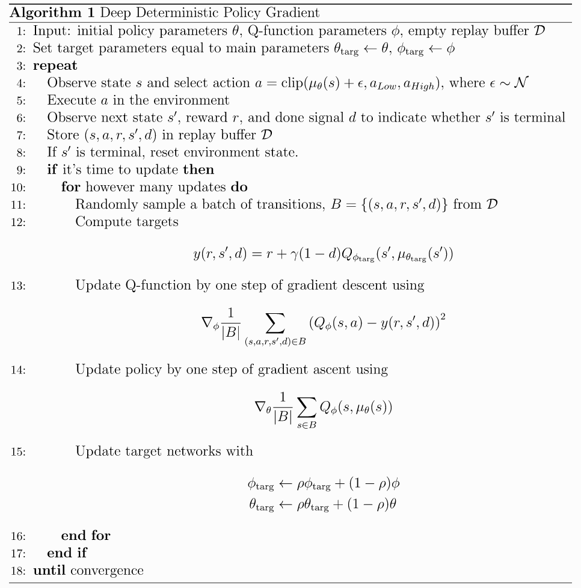

# Report

## Learning Algorithm

The project trains a DDPQ agent:



(Image taken from [here](https://spinningup.openai.com/en/latest/algorithms/ddpg.html#pseudocode))

The policy (Actor) and Q function (Critic) are implemented as neural networks. Thir design takes on the following shape:

## Implementation
I borrowed the agent and model implementations [provided in the course](https://github.com/udacity/deep-reinforcement-learning/tree/master/finance)

However, the **course implementation contains two bugs** which I fixed in my implementation.

### Udacity code Bug-Fix #1:

Whereas the [original code](https://github.com/udacity/deep-reinforcement-learning/blob/561eec3ae8678a23a4557f1a15414a9b076fdfff/finance/ddpg_agent.py#L152)
uses a uniform sample within the OU noise sampling (uniform in [0 1] and therefor causing a positive bias), my code fixes this and correctly samples from a normal(0,1) distribution there:
```
dx = self.theta * (self.mu - x) + self.sigma * np.array([np.random.normal() for i in range(len(x))])
```
This bug fix has been suggested for the Udacity repo but the PR was [closed rather than corrected :(](https://github.com/udacity/deep-reinforcement-learning/issues/20)

### Udacity code Bug-Fix #2:

It seems that the Udacity agent implementation does not prevent the optimizer from updating the Q target network. The [following lines](https://github.com/udacity/deep-reinforcement-learning/blob/561eec3ae8678a23a4557f1a15414a9b076fdfff/finance/ddpg_agent.py#L97-L99) whould be `with torch.no_grad()`:
as I've done in my code:
```python
actions_next = self.actor_target(next_states)
with torch.no_grad(): # prevent gradient update of the critic_target network
    Q_targets_next = self.critic_target(next_states, actions_next)
    # Compute Q targets for current states (y_i)
    Q_targets = rewards + (gamma * Q_targets_next * (1 - dones))
# Compute critic loss
Q_expected = self.critic_local(states, actions)
critic_loss = F.mse_loss(Q_expected, Q_targets)

```
(I'd put up a PR but it looks like they are ignored and closed. If you are a Udacity reviewer - please suggest next steps)

These two corrections seem to have allowed for a large speed-up in convergence to a successful agent

### Actor network:
```
Actor(
  (fc1): Linear(in_features=33, out_features=400, bias=True)
  RELU()
  (fc2): Linear(in_features=400, out_features=300, bias=True)
  RELU()
  (fc3): Linear(in_features=300, out_features=4, bias=True)
  tanh()
)
```
The policy network takes in the (33 dimensional) state as input to the first layer.
The policy outputs are continuous and expected in [-1 1] which is acieved with a tanh as the last layer's activation.

### Critic network:

The Critic takes the state as input to the first layer, but, as a Q function. the (4 dimensional) action is also provided as input by concatenation to the first layer's output as the input to the second layer.
```
Critic(
  (fc1): Linear(in_features=33, out_features=400, bias=True)
  RELU()
  (fc2): Linear(in_features=404, out_features=300, bias=True) # action is concatenated
  RELU()
  (fc3): Linear(in_features=300, out_features=1, bias=True)  
```
There is no activation in the final layes (Q values are unbounded)

As explained in the Algorithm figue, DDPG has two copies of each network. The second, called the target (subscript `targ` in the algorithm figure) is updated by polyac averaging.

## Training:
I ran 20 agents sharing the same model, replay buffer and action injected noise process (Ornstein-Uhlenbeck) but running on different environments.

Since the noise process was shared, all the agents received the same action modification at the same time however, since they were each operating on a different arm and targep region state - this shared action adjustment has no consequence.

The expereince tuples from all the agents were added to the share replay buffer at each evironment step however the sared model was updated only once every `steps_to_learn` and it was then updated with `update_learn` optimizer updates, each on new sample of minimatches.

## Parameters:

### Agent parameters
```
BUFFER_SIZE = int(1e6)  # replay buffer size
BATCH_SIZE = 1024       # minibatch size
GAMMA = 0.99            # discount factor
TAU = 1e-3              # for soft update of target parameters (appears as ro in the algorithm figure)
LR_ACTOR = 1e-4         # learning rate of the actor 
LR_CRITIC = 1e-3        # learning rate of the critic
WEIGHT_DECAY = 0        # L2 weight decay
```
Hidden layer sizes are 400 and 300 as appears above

### Training parameters:
Number of steps (for all 20 agents) beween model updates: `15`

Number of consecutive (Adam) optimizer updates within a single model update step: `20`

## Results:
With the above settings the model passed the success requirement (average over 100 episodes and 20 agents above 30) in the 106th episode. Just 6 episodes after it had enough in its averaging window to start chacking for this stopping criterion !


## Ideas for Future Work
* Find ways of reducing the number of attepts at finding parameters that work. In real life situations, each episode, including those from previous training attepts should count towards the number of episodes till success.
* Use a priority Queue
* Apply some of the tricks from TD3 as described [here](https://spinningup.openai.com/en/latest/algorithms/td3.html#background)
* Try D4PG which is more suited for distributed agents.
